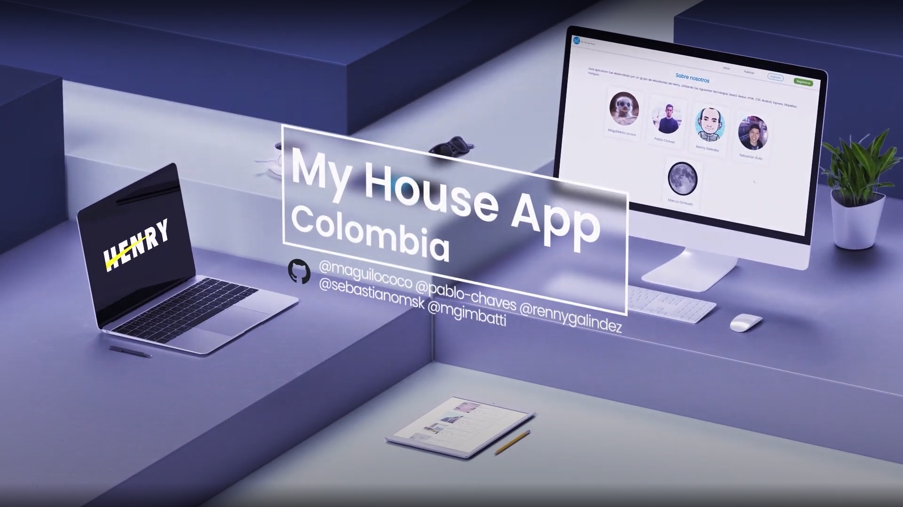
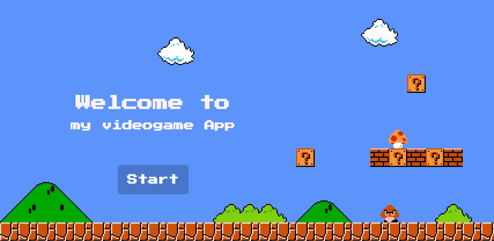
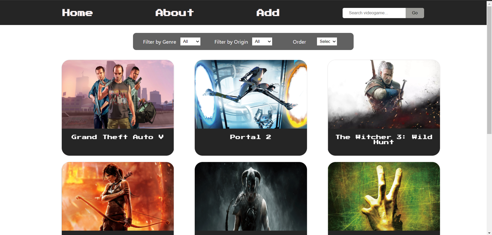
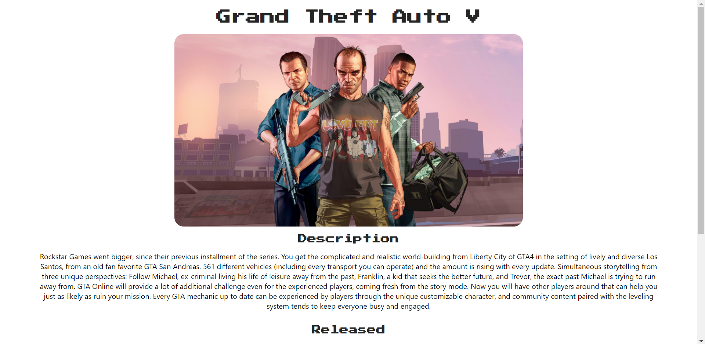
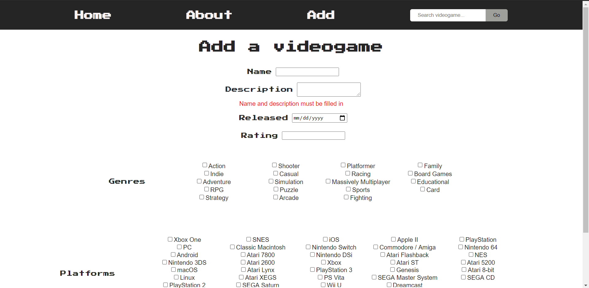

### Hi there, I'm Marcos 👋.


```javascript
const marcos = {
  code: ['Javascript', 'HTML', 'CSS'],
  technologies: {
    frontEnd: ['React', 'Redux'],
    backEnd: ['Node', 'Express'],
    dataBases: ['PostgreSQL']
  },
}
```
<br></br>
<br></br>
<br></br>
<br></br>
<h2 align="left">Projects</h2>

<h3>My House App</h3>
  <p>
    Developed in a 5-member-team using Agile Methodologies (SCRUM and Github Boards). 
  </p><p>
    Technologies applied: React, Redux, Node.js, Express, Sequelize and Postgres.
  </p><p>
    Other libraries: Auth0, Google Geocoding API, Mapbox API, MercadoPago and Nodemailer.
  </p><p>
  <h4>🎥 Click on image and go to video promo!</h4>
<a href="https://www.youtube.com/watch?v=wGsvqJFBktY"
target="_blank"></a>
<br></br>
  Go to live version <a href="https://my-house-app-one.vercel.app/" target="_blank"><b>here</b></a>!
  Repositories: <a href="https://github.com/myhouseapp/client" target="_blank">Front-end</a> & </a><a href="https://github.com/my-house-app/api" target="_blank">Back-end</a>
  </p>

<h3>Videogames App</h3>

VideogamesApp is a fictional website created as an individual project for <a href="https://soyhenry.com/">Henry</a>. The instructions were: create an App to show data from <a href="https://rawg.io/apidocs">RAWG API</a> using React, Redux, Node, and Sequelize.

</a>
</a>
</a>
</a>

Repository: <a href="https://github.com/mgimbatti/videogames" target="_blank">Videogames</a>
